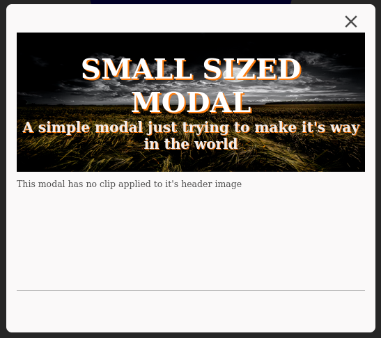

# JustBard Simple Modal

A very simple, lightweight modal and control system made using pure vanilla javascript.

## Installation

`npm install justbard-simple-modal`

## Getting Started

Copy over the needed CSS and JS from the node_modules install directory to your project directory and import them as you would any normal js/css file.

I.E.

```
<link rel="stylesheet" href="css/jb_modal.css" />
<script src="js/jb_modal.js"></script>
```

To build the modal object div call `buildJBModal()`

To Open the modal call `openJBModal()`

JBModal supports various parameters for use during the building call.

The defaults are below:

```
jbModalParams.modalSize = false;
jbModalParams.buildHeader = true;
jbModalParams.closeEverywhere = true; // Grants the ability to close by clicking outside.
jbModalParams.jb_modal_header_image = false;
jbModalParams.jb_modal_header_image_clip = false;
jbModalParams.jb_modal_header_1 = false;
jbModalParams.jb_modal_header_2 = false;
jbModalParams.set_empty_content = true;
jbModalParams.set_empty_footer = true;
```

To build the small sized modal with a header image, header text and main body content:

```
jbModalParams.jb_modal_header_image =
	'https://images.unsplash.com/photo-1512987415479-85f370bca602?ixlib=rb-1.2.1&ixid=MnwxMjA3fDB8MHxwaG90by1wYWdlfHx8fGVufDB8fHx8&auto=format&fit=crop&w=1170&q=80';
jbModalParams.jb_modal_header_1 = 'Small Sized Modal';
jbModalParams.jb_modal_header_2 =
	"A simple modal just trying to make it's way in the world";
jbModalParams.jb_modal_header_image_clip = '--clip-bottom';
buildJBModal("This modal has a bottom clip applied to it's header image");
```



### Updating Content:

To update the header content:

```
updateJBModaHeader(
		'https://images.unsplash.com/photo-1643575102128-0d6b42fbdda1?ixlib=rb-1.2.1&ixid=MnwxMjA3fDB8MHxwaG90by1wYWdlfHx8fGVufDB8fHx8&auto=format&fit=crop&w=1332&q=80',
		'--clip',
		'Some New Header',
		'Wow this is some info!'
	);
```

To update the main body content:

`updateJBModalContent("Some New Information! <br /><br /><strong>Can't miss out on knowing this new stuff!</strong>"); `

To update the footer content:

`updateJBModalFooterContent("Some New Footer Information!");`
